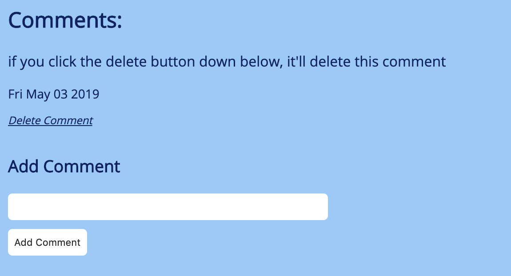

# Thomas Monfre CS52 Lab 5 :floppy_disk:

## What I Did
For this assignment, I built the database and server required for the live blog hosted at [tmonfre-blog.surge.sh](https://tmonfre-blog.surge.sh). This web server provides endpoints for creating posts, fetching posts, and deleting posts. The app is hosted on Heroku with the following endpoint [https://cs52-tmonfre-lab5.herokuapp.com/api/](https://cs52-tmonfre-lab5.herokuapp.com/api/).

## What Worked / Didn't Work
I started out by building the infrastructure of the server, and connecting the various components together. This included creating a router, building a basic `GET` route, pointing the server to the router (prefixed with `/api`), then having the route send some basic text. Once I had this in place, I then built the database schema for a post (model) and built a controller to handle interaction with the database. This included a function to create a post object, update a post object, and delete a post object. I then imported the controller into the router, and had everything set up. Once I had this in place, I then built the rest of the web server. I wrote each endpoint and tested each locally with my lab 4 page.

I had some problems with the view post page of the blog not updating after hitting the update post endpoint. I realized that the `update` function that mongoose supports returns an object saying the document was updated, not the document itself. I was just sending this document to the frontend when a post was updated, which of course didn't contain the information necessary for viewing the post, forcing the user to have to refresh. Once I realized this, I nested some promises on the web server. Once the post is updated in the database, we fetch that post, then send it to the user. If there is an error at any point in that process, we send a 500 error.

## Extra Credit

### Tags as an array
Post tags are stored in an array in the database, rather than just a string.

### Comments
A user can leave comments on any post. Comments are stored in an Array for each Post object. Comments have a string representing the text and a timestamp representing when the post was created. Users can also delete comments.

---

# Lab 5 Updates :floppy_disk:

## What I Did
I added user authentication to the web app. Users can create an account, log in, and log out. There's also a permissions hierarchy. You must be signed in to create, update, or delete a post or comment.

## What Worked / Didn't Work
I started out by creating the user auth model and controller. Once I had the base version of this working with cURL, I then tested it on my frontend and made changes/updates as I went.

I then updated the way I was storing comments by creating a Comments model. Each post has an array of comment objects. This cleaned up the structure of the database, and allowed for more information and user references to be stored.

I had some trouble with deleting comments at first. For some reason, the `findByIDAndDelete` method from mongoose wasn't working for me. Instead, I had to `findOne` then delete it.

## Extra Credit

### Comments
Only authenticated users can see comments and make comments. You must be authenticated to delete your own comment. Username of author of comment is stored to display on frontend. Since username is a unique field, this also allows for ensuring one can delete a given comment, since they must be authenticated to hit the controller.